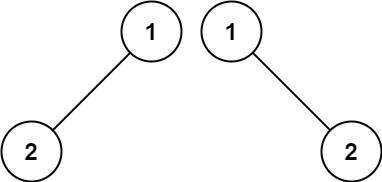

# leetcode算法详述

## 四、二叉树 binary-tree

### 94. 二叉树的中序遍历
简单

给定一个二叉树的根节点 root ，返回 它的 中序 遍历 。

示例 1：

输入：root = [1,null,2,3]

输出：[1,3,2]

示例 2：

输入：root = []

输出：[]

示例 3：

输入：root = [1]

输出：[1]

提示：

树中节点数目在范围 [0, 100] 内

-100 <= Node.val <= 100

进阶: 递归算法很简单，你可以通过迭代算法完成吗？

### 95. 不同的二叉搜索树 II
中等

给你一个整数 n ，请你生成并返回所有由 n 个节点组成且节点值从 1 到 n 互不相同的不同 二叉搜索树 。可以按 任意顺序 返回答案。

示例 1：

输入：n = 3

输出：[[1,null,2,null,3],[1,null,3,2],[2,1,3],[3,1,null,null,2],[3,2,null,1]]

示例 2：

输入：n = 1

输出：[[1]]

提示：
1 <= n <= 8

### 96. 不同的二叉搜索树
中等

给你一个整数 n ，求恰由 n 个节点组成且节点值从 1 到 n 互不相同的 二叉搜索树 有多少种？返回满足题意的二叉搜索树的种数。

示例 1：

输入：n = 3

输出：5

示例 2：

输入：n = 1

输出：1

提示：

1 <= n <= 19

### 98. 验证二叉搜索树
中等

给你一个二叉树的根节点 root ，判断其是否是一个有效的二叉搜索树。

有效 二叉搜索树定义如下：

节点的左子树只包含 小于 当前节点的数。

节点的右子树只包含 大于 当前节点的数。

所有左子树和右子树自身必须也是二叉搜索树。

示例 1：

输入：root = [2,1,3]

输出：true

示例 2：

输入：root = [5,1,4,null,null,3,6]

输出：false

解释：根节点的值是 5 ，但是右子节点的值是 4 。

提示：

树中节点数目范围在[1, 104] 内

-231 <= Node.val <= 231 - 1

### 99. 恢复二叉搜索树
中等

给你二叉搜索树的根节点 root ，该树中的 恰好 两个节点的值被错误地交换。请在不改变其结构的情况下，恢复这棵树 。

示例 1：

输入：root = [1,3,null,null,2]

输出：[3,1,null,null,2]

解释：3 不能是 1 的左孩子，因为 3 > 1 。交换 1 和 3 使二叉搜索树有效。

示例 2：

输入：root = [3,1,4,null,null,2]

输出：[2,1,4,null,null,3]

解释：2 不能在 3 的右子树中，因为 2 < 3 。交换 2 和 3 使二叉搜索树有效。

提示：

树上节点的数目在范围 [2, 1000] 内

-231 <= Node.val <= 231 - 1

进阶：使用 O(n) 空间复杂度的解法很容易实现。你能想出一个只使用 O(1) 空间的解决方案吗？

### 100. 相同的树
简单

给你两棵二叉树的根节点 p 和 q ，编写一个函数来检验这两棵树是否相同。

如果两个树在结构上相同，并且节点具有相同的值，则认为它们是相同的。

示例 1：

输入：p = [1,2,3], q = [1,2,3]

输出：true

示例 2：

输入：p = [1,2], q = [1,null,2]

输出：false

示例 3：

输入：p = [1,2,1], q = [1,1,2]

输出：false

提示：

两棵树上的节点数目都在范围 [0, 100] 内

-104 <= Node.val <= 104

### 101. 对称二叉树
简单

给你一个二叉树的根节点 root ， 检查它是否轴对称。

示例 1：

输入：root = [1,2,2,3,4,4,3]

输出：true

示例 2：

输入：root = [1,2,2,null,3,null,3]

输出：false

提示：

树中节点数目在范围 [1, 1000] 内

-100 <= Node.val <= 100

进阶：你可以运用递归和迭代两种方法解决这个问题吗？

### 144. 二叉树的前序遍历
简单

给你二叉树的根节点 root ，返回它节点值的 前序 遍历。

示例 1：

输入：root = [1,null,2,3]

输出：[1,2,3]

示例 2：

输入：root = []

输出：[]

示例 3：

输入：root = [1]

输出：[1]

示例 4：

输入：root = [1,2]

输出：[1,2]

示例 5：

输入：root = [1,null,2]

输出：[1,2]

提示：

树中节点数目在范围 [0, 100] 内, -100 <= Node.val <= 100

进阶：递归算法很简单，你可以通过迭代算法完成吗？

### 145. 二叉树的后序遍历
简单
给你一棵二叉树的根节点 root ，返回其节点值的 后序遍历 。

示例 1：

输入：root = [1,null,2,3]

输出：[3,2,1]

示例 2：

输入：root = []

输出：[]

示例 3：

输入：root = [1]

输出：[1]

提示：

树中节点的数目在范围 [0, 100] 内

-100 <= Node.val <= 100

进阶：递归算法很简单，你可以通过迭代算法完成吗？

